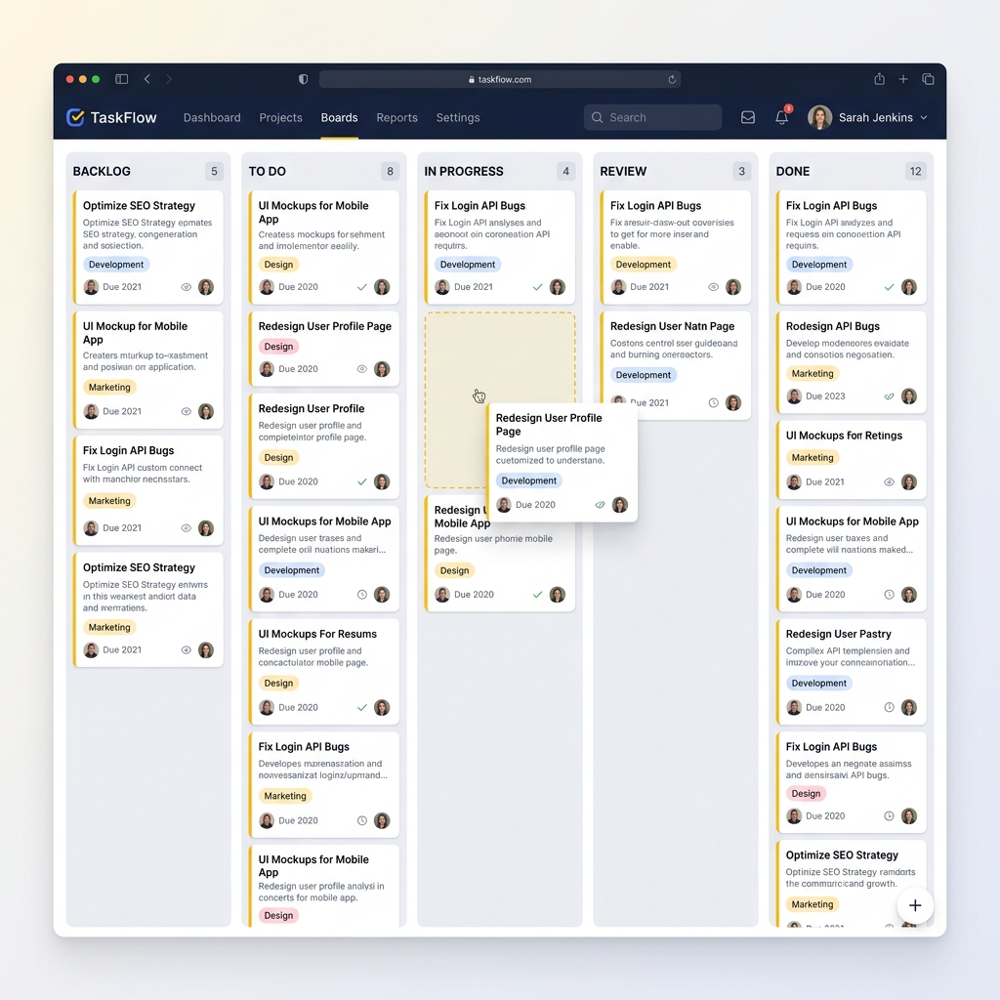

# Kanban App MVP

A simple, client-rendered Kanban board built with Next.js and dnd-kit.



## Features

- 5 fixed columns (can be renamed)
- Add, delete, and move cards between columns
- Slick, professional UI using a strict color scheme
- Drag and drop interface
- Dummy data populated on load

## Tech Stack

- Next.js (Client rendered)
- React
- Vanilla CSS Modules
- dnd-kit for drag and drop
- Jest & React Testing Library
- Playwright for E2E testing

## Running Locally

First, install dependencies:

```bash
npm install
```

Then, run the development server:

```bash
npm run dev
```

Open [http://localhost:3000](http://localhost:3000) with your browser to see the application.

## Testing

Run unit tests:

```bash
npm run test
```

Run E2E tests:

```bash
npm run e2e
```
